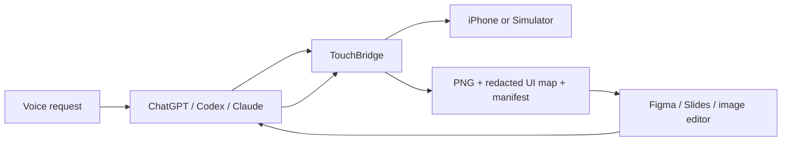

<div align="center">
  
  <h1>TouchBridge</h1>
  <p><strong>Let an AI see, control, test, and redesign what is on an iPhone.</strong></p>
</div>

TouchBridge is a local-first MCP server for iOS simulators and physical devices. It gives ChatGPT, Codex, Claude, Cursor, and other MCP hosts a reliable action layer for app testing—and a structured screenshot bridge for voice-driven design work.

The design workflow is the unusual bit: “capture this screen for editing” produces a full-resolution image, redacted accessibility geometry, a preview, and a versioned manifest. An orchestrating agent can then reconstruct the screen in Figma, annotate it, compare revisions, or hand it to another editor.

## Why TouchBridge

- One tool surface for simulators and real iPhones.
- Active-device filtering avoids stale, paired, or disconnected hardware.
- Sensitive text is redacted from tool results, logs, and design artifacts.
- Durable design snapshots are useful beyond a single agent session.
- A loopback-only live viewer never binds to the public network.
- `doctor` diagnoses the entire local toolchain in one call.
- CI covers Node 20.17 and Node 22, with no production audit findings.

## Voice-to-design loop



MCP servers do not need to call one another or share credentials. The host agent coordinates TouchBridge and the design tool.

## Capabilities

| Capability | Simulator | Physical device |
|---|---:|---:|
| Tap, swipe, type, and press buttons | Yes | Yes |
| Scan interactive elements | Yes | Yes |
| Read the accessibility hierarchy | Yes | Yes |
| Capture temporary screenshots | Yes | Yes |
| Capture durable design snapshots | Yes | Yes |
| List and launch apps | Yes | Yes |
| Live browser viewer | — | Yes |
| Structured environment diagnostics | Yes | Yes |

## Requirements

- macOS
- Xcode command-line tools
- Node.js 20.17 or newer
- Homebrew
- Developer Mode and trust pairing for a physical iPhone/iPad

## Run from source

```bash
git clone https://github.com/MarshallBear1/touchbridge-mcp.git
cd touchbridge-mcp
npm install
npm run check
npm link
touchbridge --setup-all
```

Restart the MCP host, boot a simulator or connect an unlocked device, then ask:

```text
Run TouchBridge doctor, find my active iPhone, and test the login flow.
```

Or:

```text
Capture the current screen for editing, reconstruct the interactive regions in Figma,
and label anything that fails accessibility checks.
```

## MCP tools

| Tool | Purpose |
|---|---|
| `get_execution_context` | Resolve the active simulator/device and viewer state |
| `doctor` | Diagnose Node, Xcode, Simulator, idb, image tooling, WDA, and targets |
| `scan_ui` | Return interactive elements with device-point coordinates |
| `describe_screen` | Return the visible UI/accessibility hierarchy |
| `device_action` | Perform one tap, swipe, key, button, or text action |
| `device_actions` | Perform a sequence of actions |
| `get_screenshot` | Capture a temporary screenshot for visual verification |
| `capture_design_snapshot` | Create a durable, redacted design handoff bundle |
| `list_devices` | List active simulators and physical devices |
| `launch_app` | Launch an installed app by bundle identifier |
| `list_apps` | List installed apps |
| `setup_device` | Prepare WebDriverAgent commands for a physical device |

See [the snapshot contract](docs/design-snapshot-capture.md) and [the orchestration architecture](docs/voice-design-workflow.md).

## Local data and security

TouchBridge stores its state beneath `~/.touchbridge/`.

```text
~/.touchbridge/
├── captures/       durable design handoffs
├── python/         isolated idb environment
├── idb-companion/  local companion support
├── wda-build/      WebDriverAgent source and build data
└── bin/            native accessibility helper
```

- The live viewer listens on `127.0.0.1` only.
- Capture names are sanitized and cannot escape the capture directory.
- Password, passcode, PIN, OTP, verification-code, secret, and API-key fields are redacted.
- Text input values are never echoed in MCP results or logs.
- TouchBridge stores no Figma, ChatGPT, Claude, or other third-party credentials.

## Development

```bash
npm install
npm run typecheck
npm test
npm run check
npm pack --dry-run
```

CI runs the full check on macOS with Node 20.17 and Node 22.

## Roadmap

- Semantic element targeting (`tap "Continue"` without manual coordinates)
- Screenshot diffing and visual-regression baselines
- Session recording and replayable test scripts
- Editable Figma reconstruction with component matching
- Voice interruption, confirmation, and undo policies
- Multi-device test matrices
- Pluggable privacy policies for regulated apps

## License and attribution

TouchBridge is MIT licensed. It includes work derived from the MIT-licensed `iPhone-mcp` project; the required upstream copyright notice is preserved in [LICENSE](LICENSE), with provenance in [NOTICE.md](NOTICE.md).
