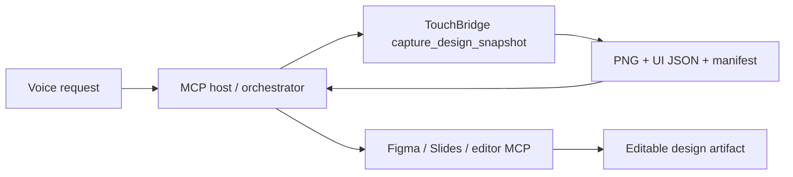

# Voice-driven visual editing

The useful product boundary is larger than remote taps: TouchBridge is the visual sensor and action layer inside a multi-tool editing loop.

## Example

> “Take a picture of the current pricing slide, preserve the phone dimensions, and make a Figma-ready handoff.”

An MCP host can translate that into:

1. Call `capture_design_snapshot` with `{ "name": "pricing slide" }`.
2. Inspect the returned preview with the model.
3. Read `manifest.json` for the full-resolution image, point/pixel dimensions, and accessibility geometry.
4. Call a connected Figma, Slides, image-editing, or document tool with the PNG and the user's requested changes.
5. Return the created design URL or artifact to the user.

## Why the manifest matters

A PNG alone gives an editor pixels. The manifest also gives it:

- full-resolution pixel dimensions;
- the phone coordinate space in points;
- labels, element types, and frames for visible UI;
- a stable `design-snapshot@1` contract;
- the exact source target and capture time.

That is enough for an orchestrator to reconstruct editable layers, compare revisions, annotate bugs, or generate a design specification without putting design-service credentials inside TouchBridge.

## High-value extensions

- Visual diff: capture before/after snapshots and emit changed regions and a similarity score.
- Session recorder: save a sequence of actions, screenshots, UI trees, timings, and failures as a replayable QA trace.
- Named anchors: say “highlight the Continue button” and include its frame in the handoff.
- Editor return path: accept an edited PNG/spec from a design tool and compare it with the live implementation.
- Voice macros: “test checkout and make a bug board” becomes a recorded flow plus evidence bundles.
- Privacy profiles: redact emails, names, account balances, health data, or all text for sensitive apps.
- Cross-platform contract: reuse `design-snapshot@1` for Android, desktop, browser, and slide canvases.
